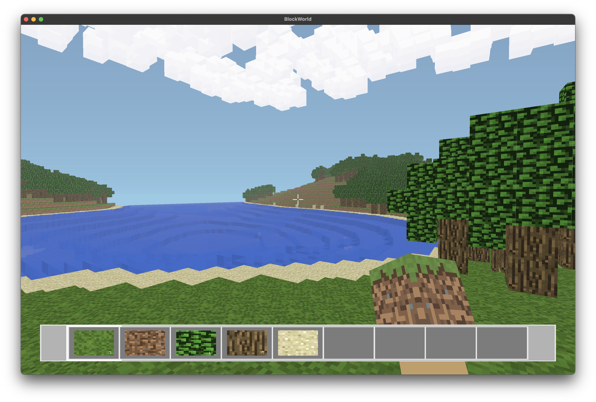

# BlockWorld

[](https://github.com/markoelez/blockworld/actions/workflows/rust.yml)

A Minecraft-inspired voxel game built in Rust with wgpu.





## Getting Started

Requires [Rust](https://rustup.rs/).

```bash
# Clone and run
git clone https://github.com/yourusername/blockworld.git
cd blockworld
cargo run --release
```

## Controls

| Key | Action |
|-----|--------|
| `WASD` | Move |
| `Space` | Jump |
| `Shift` | Sprint |
| `1-6` | Select inventory slot |
| `E` | Place block / Eat food / Open chest |
| `R` | Break block / Attack / Respawn when dead |
| `T` | Give torch (debug) |
| `C` | Give chest (debug) |
| `F3` | Toggle debug info |
| `Escape` | Pause menu |

## Features

### World Generation
- **Biomes**: Plains, Forest, Desert, Mountains, Tundra, Ocean
- **Terrain**: Procedural generation with Perlin noise, varied elevation
- **Caves**: Underground cave systems with stalactites and stalagmites
- **Ore Veins**: Coal, Iron, Gold, Diamond distributed by depth
- **Structures**: Villages with houses, dungeons with mob spawners, mineshafts
- **Water**: Realistic water with wave animation and flow simulation

### Survival Mechanics
- **Health System**: 10 hearts (20 HP), damage from environment and mobs
- **Hunger System**: 10 drumsticks, depletes over time, affects health regeneration
- **Damage Sources**:
  - Fall damage (3+ blocks)
  - Lava damage (4/sec)
  - Drowning (after air depletes)
  - Hostile mob attacks
- **Food**: Kill animals for meat, eat to restore hunger
- **Death**: Drop inventory on death, respawn at spawn point

### Mobs & Entities
- **Hostile Mobs**: Zombies chase and attack players
- **Passive Animals**: Pigs, Cows, Sheep, Chickens, Rabbits, Horses, Wolves, Foxes
- **Aquatic Life**: Fish, Squid, Dolphins
- **Flying Creatures**: Bats, Bees, Parrots
- **Villagers**: NPCs that wander around villages
- **Dropped Items**: Blocks and food drop as pickups

### Combat
- Attack mobs and animals with fists
- Knockback on hit
- Damage cooldown with invincibility frames
- Animals flee when attacked, drop meat when killed

### Weather System
- **Clear/Cloudy/Rain/Storm** weather cycles
- Rain and snow particles
- Thunder and lightning during storms
- Dynamic fog density based on weather
- Volumetric 3D clouds with drift animation

### Day/Night Cycle
- Realistic sky with atmospheric scattering
- Sun and moon with glow effects
- Stars visible at night
- Time-based lighting changes

### Visual Effects
- HDR rendering with bloom
- Shadow mapping
- Underwater distortion and blue tint
- Block break particles
- Torch flame particles
- Weather particles (rain, snow)
- Damage flash overlay

### Audio
- Ambient background music
- Footstep sounds (vary by block type)
- Block break/place sounds
- Jump and land sounds
- Water splash sounds
- Thunder during storms

### UI
- Hotbar with item icons and counts
- Health bar (hearts)
- Hunger bar (drumsticks)
- Air bubbles when underwater
- Pause menu
- Chest interface
- Debug overlay (F3)
- Death screen with respawn

### Blocks
| Block | Description |
|-------|-------------|
| Grass, Dirt, Stone | Basic terrain |
| Wood, Leaves, Planks | Trees and building |
| Sand, Gravel, Clay | Sediment |
| Snow, Ice | Cold biomes |
| Cobblestone, Brick, Mossy Cobblestone | Building materials |
| Coal, Iron, Gold, Diamond | Ores |
| Water, Lava | Fluids |
| Torch | Light source |
| Chest | Storage container |
| Fence, Rail | Decorative/structural |

### Food Items
| Item | Source | Hunger Restored |
|------|--------|-----------------|
| Raw Pork | Pig | 3 |
| Raw Beef | Cow | 3 |
| Raw Mutton | Sheep | 2 |
| Raw Chicken | Chicken | 2 |

## Technical Details

- **Language**: Rust
- **Graphics**: wgpu (WebGPU API)
- **Windowing**: winit
- **Audio**: rodio
- **Noise Generation**: noise-rs (Perlin, Simplex)

### Performance
- Greedy meshing for efficient chunk rendering
- Frustum culling
- Chunk-based world loading/unloading
- Parallel mesh generation with rayon
- Separate opaque/transparent render passes

## License

MIT
